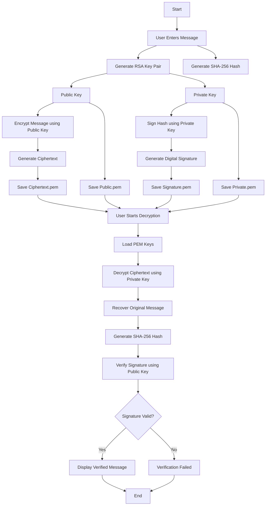
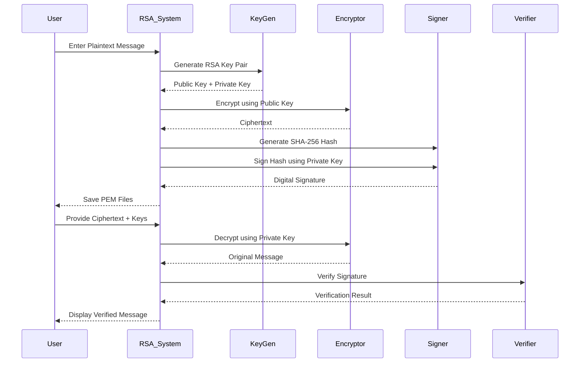
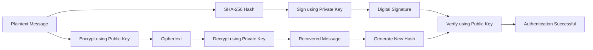
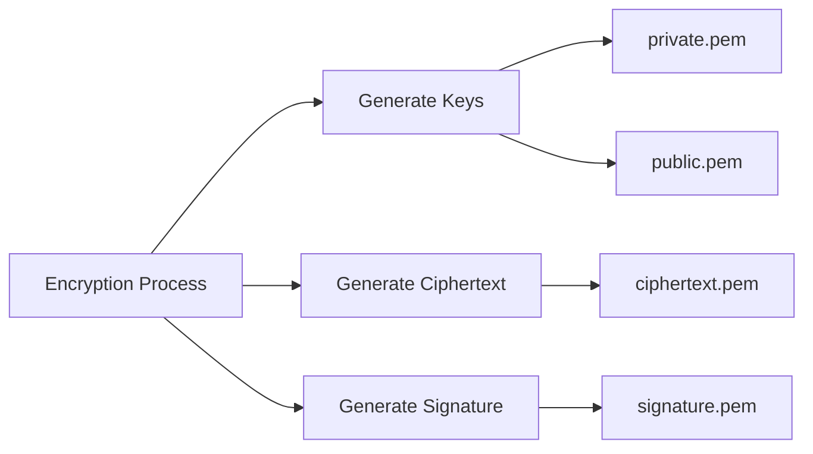

# 🔐 RSA Cryptography Lab System

A professional implementation of the **RSA Cryptographic Algorithm** using Python and the **PyCryptodome** library.
This project demonstrates:

* RSA Key Generation
* RSA Encryption & Decryption
* Digital Signature Creation
* Signature Verification
* Secure Message Handling using OAEP Padding

# 📖 Introduction

RSA (Rivest–Shamir–Adleman) is one of the most widely used **asymmetric cryptographic algorithms** for secure data transmission.

Unlike symmetric encryption, RSA uses:

* **Public Key** → Used for Encryption
* **Private Key** → Used for Decryption

This project also implements:

* **Digital Signatures**
* **SHA-256 Hashing**
* **OAEP Secure Padding**

to ensure:

✅ Confidentiality
✅ Authentication
✅ Integrity
✅ Non-repudiation

---

# ✨ Features

* 🔑 Generates a new RSA key pair every encryption
* 🔐 Encrypts messages using RSA-OAEP
* ✍️ Creates digital signatures using SHA-256
* ✔️ Verifies digital signatures
* 📂 Saves keys and encrypted data into `.pem` files
* 🛡️ Uses secure cryptographic standards

---

# 🧠 RSA Algorithm Overview

RSA is an **asymmetric encryption algorithm** based on the mathematical difficulty of factoring large prime numbers.

## Components

| Component         | Purpose                    |
| ----------------- | -------------------------- |
| Public Key        | Encrypt message            |
| Private Key       | Decrypt message            |
| SHA-256           | Hash message               |
| Digital Signature | Verify sender authenticity |
| OAEP Padding      | Secure RSA encryption      |

# ⚙️ Working Process

## Encryption Phase

1. User enters a plaintext message.
2. System generates:

   * Public Key
   * Private Key
3. Message is encrypted using the **Public Key**.
4. SHA-256 hash is generated from the message.
5. Hash is digitally signed using the **Private Key**.
6. Ciphertext, signature, and keys are stored in files.

## Decryption & Verification Phase

1. User provides:

   * Public Key
   * Private Key
   * Ciphertext
   * Signature
2. Ciphertext is decrypted using the **Private Key**.
3. SHA-256 hash is generated from decrypted message.
4. Signature is verified using the **Public Key**.
5. If valid:

   * Message is displayed
   * Signature verified successfully

---

# 🔄 Sequence Process Diagram

```text
┌──────────┐
│   User   │
└────┬─────┘
     │
     │ Enter Message
     ▼
┌────────────────────┐
│ RSA Key Generation │
└────┬───────────────┘
     │
     ├──► Public Key
     │
     └──► Private Key
     │
     ▼
┌────────────────────┐
│ Encrypt Message    │
│ using Public Key   │
└────┬───────────────┘
     │
     ▼
┌────────────────────┐
│ Generate SHA-256   │
│ Hash               │
└────┬───────────────┘
     │
     ▼
┌────────────────────┐
│ Sign Hash using    │
│ Private Key        │
└────┬───────────────┘
     │
     ▼
┌────────────────────┐
│ Save Ciphertext,   │
│ Signature & Keys   │
└────────────────────┘
```

---

# 📊 RSA Flowchart

```text
                    ┌─────────────────┐
                    │      START      │
                    └────────┬────────┘
                             │
                             ▼
                 ┌─────────────────────┐
                 │ Select Operation    │
                 │ 1. Encrypt          │
                 │ 2. Decrypt          │
                 └────────┬────────────┘
                          │
          ┌───────────────┴────────────────┐
          │                                │
          ▼                                ▼

 ┌───────────────────┐         ┌────────────────────┐
 │ Enter Plaintext   │         │ Input PEM Keys     │
 └────────┬──────────┘         └─────────┬──────────┘
          │                                │
          ▼                                ▼
 ┌───────────────────┐         ┌────────────────────┐
 │ Generate RSA Keys │         │ Load Ciphertext    │
 └────────┬──────────┘         └─────────┬──────────┘
          │                                │
          ▼                                ▼
 ┌───────────────────┐         ┌────────────────────┐
 │ Encrypt Message   │         │ Decrypt Ciphertext │
 └────────┬──────────┘         └─────────┬──────────┘
          │                                │
          ▼                                ▼
 ┌───────────────────┐         ┌────────────────────┐
 │ Generate SHA-256  │         │ Generate SHA-256   │
 └────────┬──────────┘         └─────────┬──────────┘
          │                                │
          ▼                                ▼
 ┌───────────────────┐         ┌────────────────────┐
 │ Create Signature  │         │ Verify Signature   │
 └────────┬──────────┘         └─────────┬──────────┘
          │                                │
          ▼                                ▼
 ┌───────────────────┐         ┌────────────────────┐
 │ Save Files        │         │ Show Result        │
 └────────┬──────────┘         └─────────┬──────────┘
          │                                │
          └──────────────┬─────────────────┘
                         ▼
                 ┌──────────────┐
                 │    END       │
                 └──────────────┘
```

---

# 📁 Project Structure

```text
RSA-Lab-System/
│
├── main.py
├── private.pem
├── public.pem
├── ciphertext.pem
├── signature.pem
└── README.md
```

# 🔍 Code Explanation

## Key Generation

```python
key = RSA.generate(2048)
```

Generates a secure 2048-bit RSA key pair.

---

## Encryption

```python
cipher_Obj = PKCS1_OAEP.new(public_key)
ciphertext = cipher_Obj.encrypt(message)
```

Encrypts plaintext using RSA-OAEP.

---

## Digital Signature

```python
h = SHA256.new(message)
signature = signer.sign(h)
```

Creates a SHA-256 hash and signs it using the private key.

---

## Signature Verification

```python
verifier.verify(h, signature)
```

Verifies message authenticity using the public key.

---

# 🔐 Security Concepts Used

| Concept           | Description              |
| ----------------- | ------------------------ |
| RSA               | Asymmetric encryption    |
| OAEP              | Secure RSA padding       |
| SHA-256           | Cryptographic hashing    |
| Digital Signature | Authentication mechanism |
| PEM Files         | Secure key storage       |

---

# 📌 Sample Output

## Encryption

```text
✔ NEW KEYPAIR GENERATED
✔ Files created:
  - private.pem
  - public.pem
  - ciphertext.pem
  - signature.pem
```

---

## Verification

```text
✔ Signature Verified!
✔ Message: Hello World
```

# 🔄 Mermaid.js Diagrams

## RSA Encryption & Verification Workflow



---

# 🔐 RSA Sequence Diagram



---

# 🧠 RSA Internal Working Diagram



---

# 📂 File Generation Process


