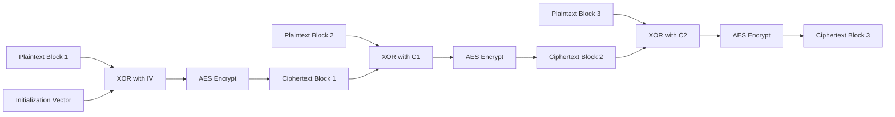
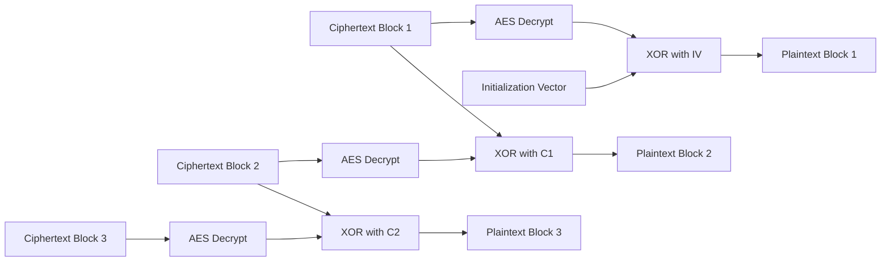
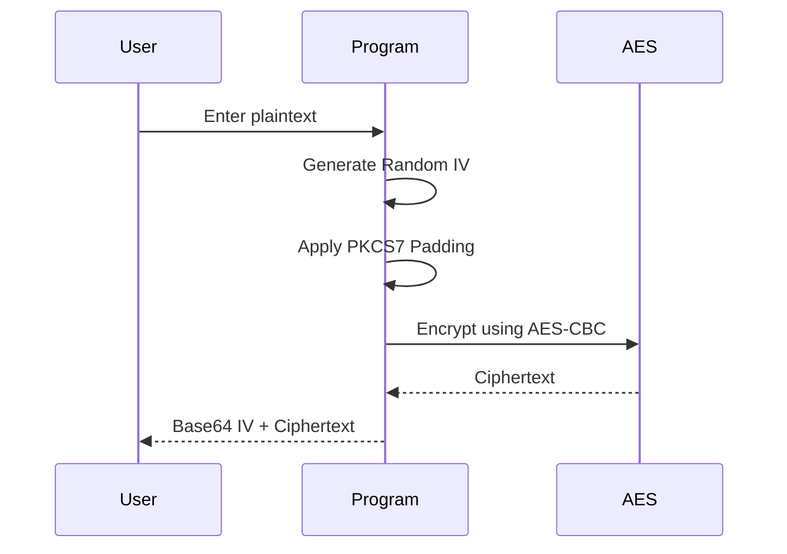
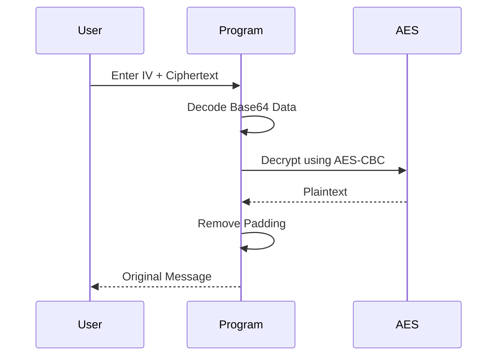

# 🔐 AES-CBC Encryption Tool

A Python implementation of **AES Encryption using CBC (Cipher Block Chaining) mode** built with the `PyCryptodome` library.

This project demonstrates how CBC mode works internally, including:

* AES encryption/decryption
* Initialization Vector (IV)
* Block chaining mechanism
* PKCS7 padding
* Base64 encoding

---

# 📖 What is CBC Mode?

CBC (**Cipher Block Chaining**) is a block cipher mode where each plaintext block is XORed with the previous ciphertext block before encryption.

Unlike ECB mode, CBC ensures that identical plaintext blocks generate different ciphertext outputs.

---

# 🧠 CBC Working Principle

## 🔄 Encryption Formula

```text id="b1i8i7"
C₁ = AES(K, P₁ ⊕ IV)
C₂ = AES(K, P₂ ⊕ C₁)
C₃ = AES(K, P₃ ⊕ C₂)
```

## 🔓 Decryption Formula

```text id="5vx4c6"
P₁ = AES⁻¹(K, C₁) ⊕ IV
P₂ = AES⁻¹(K, C₂) ⊕ C₁
P₃ = AES⁻¹(K, C₃) ⊕ C₂
```

---

# 📊 CBC Encryption Flowchart



---

# 📊 CBC Decryption Flowchart



---

# ⚙️ Project Structure

```text id="nlfxom"
.
├── main.py
└── README.md
```

---

# 🚀 Features

* ✅ AES-128 CBC Encryption
* ✅ Secure Random IV Generation
* ✅ PKCS7 Padding
* ✅ Base64 Encoded Output
* ✅ Command-Line Interface
* ✅ Encryption & Decryption Support
* ✅ Error Handling

---

# 🛠️ Technologies Used

| Technology   | Purpose              |
| ------------ | -------------------- |
| Python 3     | Programming Language |
| PyCryptodome | AES Cryptography     |
| Base64       | Encoding Binary Data |

---

# 📦 Installation

## 1️⃣ Clone Repository

```bash id="3kx27d"
git clone https://github.com/arbinch345/aes-cbc-encryption-tool.git
```

## 2️⃣ Install Dependencies

```bash id="e6l1do"
pip install pycryptodome
```

# 🔐 Encryption Workflow



---

# 🔓 Decryption Workflow



---

# 📸 Example Output

```text id="m6g52d"
key:  O9V2fK4nM8pX1aQ7bR5sTg==

===== AES.CBC Encryption Tool =====

1. Encryption
2. Decryption
3. Exit

Enter your choice: 1

Enter message to encrypt: Hello World

------ Encryption Output -----

IV             : XyZ123AbCdEf4567==
Ciphertext     : U2FsdGVkX19EncryptedText==
```

---

# 🔒 Security Considerations

⚠️ This project is for educational purposes only.

## Best Practices

* Never hardcode encryption keys
* Never reuse IVs with the same key
* Store keys securely
* Prefer authenticated encryption modes like AES-GCM in production systems

---

# 📚 Learning Outcomes

This project helps you understand:

* Symmetric Encryption
* AES Algorithm
* CBC Mode Operation
* Initialization Vectors (IVs)
* PKCS7 Padding
* Base64 Encoding
* Secure Encryption Practices
