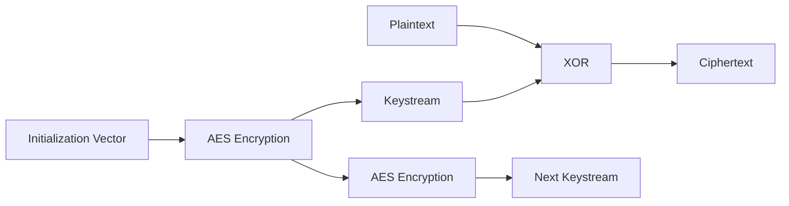

# AES OFB Mode Encryption & Decryption

## 📌 Project Overview

This project demonstrates the implementation of **AES (Advanced Encryption Standard)** using **OFB (Output Feedback) Mode** in Python with the help of the **PyCryptodome** library.

The program allows users to:

* Encrypt plaintext messages
* Decrypt ciphertext messages
* Generate secure random keys and IVs
* Encode outputs using Base64 for easy readability

---

# 🔐 What is OFB Mode?

**OFB (Output Feedback) Mode** is a block cipher mode of operation that converts a block cipher into a **stream cipher**.

Instead of encrypting plaintext blocks directly, OFB repeatedly encrypts an Initialization Vector (IV) to generate a **keystream**, which is then XORed with the plaintext to produce ciphertext.

---

# ⚙️ Working of OFB Mode

1. A random **Initialization Vector (IV)** is generated.
2. The IV is encrypted using AES.
3. The encrypted output becomes a **keystream block**.
4. The keystream is XORed with plaintext to generate ciphertext.
5. The encrypted output is again encrypted to generate the next keystream block.
6. The same process is repeated during decryption.

---

# 📊 OFB Mode Flowchart



---

# 🔄 Encryption Process Diagram

```text
                +-------------------+
IV -----------> | AES Encryption    |
                +-------------------+
                           |
                           v
                    Keystream Block
                           |
                           v
Plaintext  ---- XOR ----> Ciphertext
```

---

# 🔓 Decryption Process Diagram

```text
                +-------------------+
IV -----------> | AES Encryption    |
                +-------------------+
                           |
                           v
                    Keystream Block
                           |
                           v
Ciphertext ---- XOR ----> Plaintext
```

---

# 🧠 Features

* AES 128-bit encryption
* Secure random IV generation
* Base64 encoding support
* Menu-driven interface
* Simple and beginner-friendly implementation

---

## 1️⃣ Clone the Repository

```bash
git clone https://github.com/arbinch345/aes-ofb-mode.git
```

# 🔐 Encryption Example

```text
Enter the msg to be encrypted: Hello World

Cipher_txt : xYzAbCdEf==
IV         : pqRsTuVw==
```

---

# 🔓 Decryption Example

```text
Enter ciphertxt here: xYzAbCdEf==
Enter nonce here: pqRsTuVw==

Message Decrypted: Hello World
```

---

# 📂 Project Structure

```text
📦 AES-OFB-Mode
 ┣ 📜 main.py
 ┣ 📜 README.md
```

# 🔒 Security Notes

* OFB mode does not require padding.
* Reusing the same IV with the same key is insecure.
* Always generate a fresh random IV for every encryption.

---

# 🚀 Advantages of OFB Mode

✅ Converts block cipher into stream cipher
✅ Error propagation is minimal
✅ No padding required
✅ Suitable for streaming data

---

# ⚠️ Limitations

❌ IV reuse can compromise security
❌ Bit-flipping attacks are possible without authentication
❌ Does not provide integrity checking